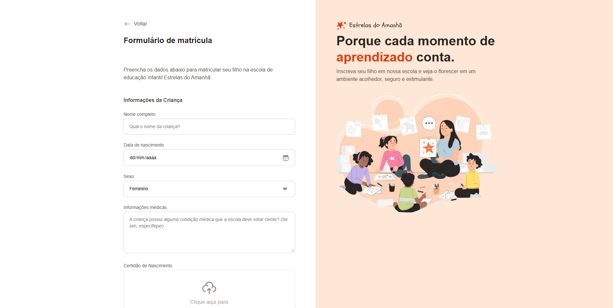

# Formulário de matrícula Estrelas do Amanhã

## Desenvolvimento de um formulário de inscrição ficticio.

Este projeto foi desenvolvido com fins de colocar em prática tecnologias absorvidas em
aulas durante o curso <b>Fullstack - Rocketseat</b>

<a href="https://ayrtonyamashita.github.io/formulario-de-matricula/">Clique aqui</a> para visitar o site em tempo real.

## 🤖 TECNOLOGIAS 
Neste momento do projeto foram utilizadas apenas as tecnologias de HTML e CSS puros sem uso de frameworks ou ferramentas auxiliares para execução. Posteriormente o projeto estará sendo atualizado regularmente com outras tecnologias como Javascript para incluir maior dinâmica e flexibilidade ao site.

## ⚒️ FERRAMENTAS
Para o inicio do escopo, apresentando a ideia inicial foi utilizando o <a href="https://www.figma.com/"> <b>Figma</b> </a> para realizar o desenho e layout do projeto, tirando do papel e adaptando ao digital.  
Com essa ferramenta foi possível apresentar a paleta de cores, fontes, tamanhos dentre outras opções presentes no projeto.
 
Iniciando na parte dos códigos, foi utilizado o <a href="https://vscode.dev/">VScode</a> devido a sua variedade de opções e aplicativos que auxiliam na proatividade do projeto.

## 🏗️ ESTRUTURA
O formulário de inscrição possui uma estrutura básica já que está no seu processo inicial de desenvolvimento, a parte que possui um pouco mais de cuidado em relação a estruturação é a organização de classes e estilos no CSS e a separação de assets do site.  

## 📺 APRESENTAÇÃO

No momento o site só funciona o Frontend sem possiblidade de consultas de API como CEP por exemplo, conforme menção anterior o projeto ainda está em desenvolvimento e deve receber atualizações no futuro.  
 
O site possui campos padrões de cadastro como dados da criança, input de dados do tipo data, checkbox, radio, file, select dentre outras funções com intuito de extrair todas possibilidades que a tecnologia HTML fornece.

<a href="https://ayrtonyamashita.github.io/formulario-de-matricula/">Clique aqui</a> para visitar o site em tempo real.

## 🔃 CHANGELOG 

11/07/2024 - Site publicado parcialmente apenas HTML e CSS.

